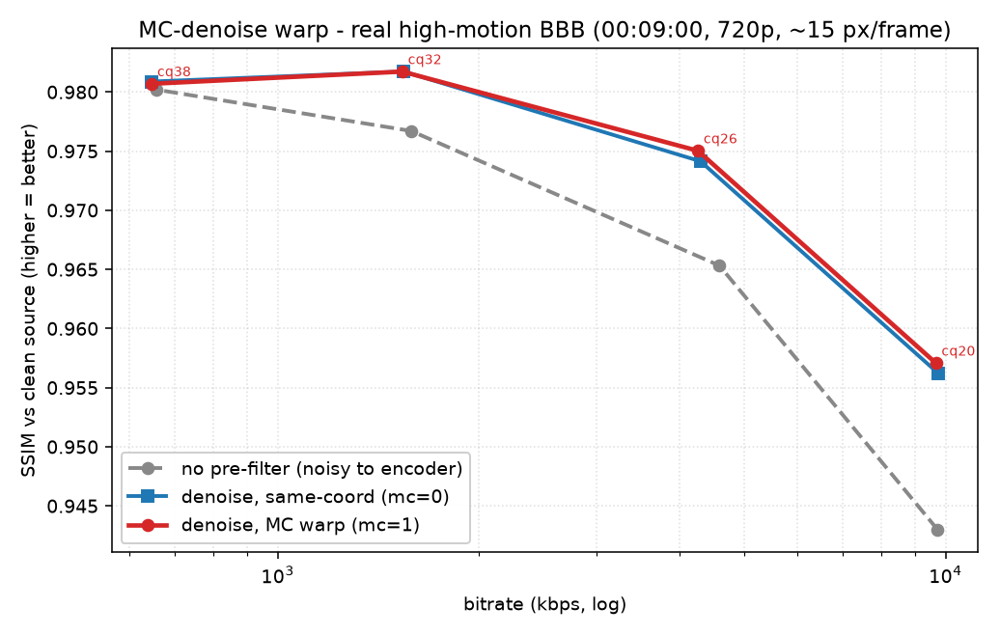
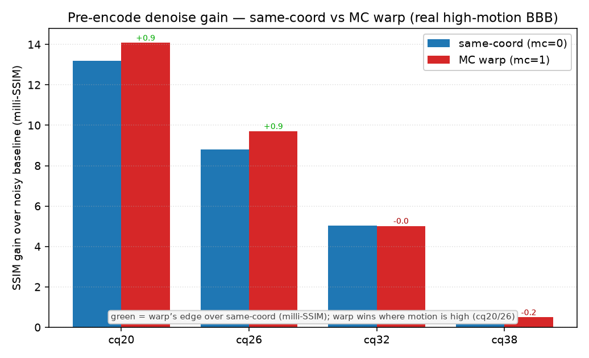
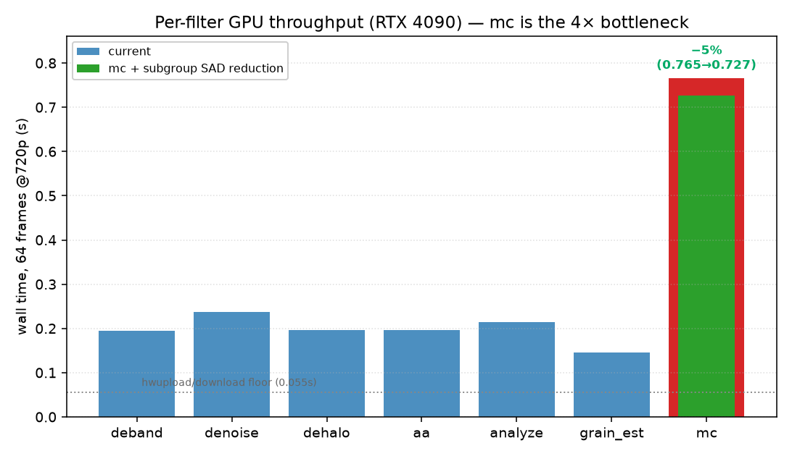

<!-- markdownlint-disable MD013 MD060 -->
# Benchmark results

Measured on real hardware via the pinned harness (`scripts/bench/`). Honest
numbers — including where Pelorus does **not** win. Methodology:
[benchmarking.md](benchmarking.md).

## Environment

- GPU: NVIDIA RTX 4090 (+ Intel Arc A380), Vulkan 1.4, 32-core host.
- ffmpeg: n8.1.1 + the Pelorus patch stack, `--enable-vulkan --enable-libshaderc`,
  linked against libpelorus 0.1.0.
- Scorer: vmafx (`build/tools/vmaf`), VMAF v0.6.1 + CAMBI.
- Encoder: `hevc_nvenc -preset p5`, CQ ladder {26,32,38,44}.

## v0.1.0 — deband, synthetic banding gradient (8-bit, 640×360, 24f)

Baseline = normal `hevc_nvenc` encode; Pelorus = same encoder, deband
pre-filter (`range=15 thry=0.012 dither=bluenoise dynamic protect`).

| CQ | variant | bitrate (kbps) | VMAF | CAMBI (banding) |
|---:|---|---:|---:|---:|
| 26 | baseline | 46.7 | 95.82 | 20.60 |
| 26 | pelorus  | 44.9 | 94.51 | 20.09 |
| 32 | baseline | 38.2 | 95.30 | 19.78 |
| 32 | pelorus  | 29.8 | 94.37 | 19.50 |
| 38 | baseline | 27.8 | 94.85 | 18.09 |
| 38 | pelorus  | 24.8 | 94.24 | 17.90 |
| 44 | baseline | 22.8 | 94.82 | 15.62 |
| 44 | pelorus  | 22.2 | 94.50 | 15.68 |

**Honest verdict: a wash at these settings, not a win.** Pelorus produces a
smaller file at every CQ (the debanded gradient compresses better), but VMAF is
~1 point lower and CAMBI barely moves. BD-rate is undefined here (the VMAF
curves don't overlap — Pelorus sits ~1 point lower throughout).

**Why** (this is the documented caveat, [research 0101](../research/0101-smart-deband.md)):
at 8-bit and these very low bitrates the **encoder quantizes the dither away and
re-bands**, so the banding reduction never reaches the decoded output, while
VMAF still penalizes the added dither vs the pristine source. Deband's win
requires headroom for the dither to survive:

- **10-bit output** (`p010`/`yuv420p10`) — the primary lever; dithered gradients
  survive 10-bit quantization where they're crushed at 8-bit.
- higher bitrate (lower CQ), and content with *real* banding (clean live-action
  like the pinned BBB segment has CAMBI ≈ 0 — nothing to deband).

## What is proven now

- The full zero-copy pipeline **runs end-to-end on real hardware** (decode →
  Vulkan deband in VRAM → NVENC), and the filters link + register in ffmpeg.
- The bench is **pinned + repeatable** (`corpus.lock` sha-pinned BBB + a
  deterministic synthetic clip).
- A real **link bug** was found by running it: `require_pkg_config` added cflags
  but not `-lpelorus`; fixed with `add_extralibs`, and CI now links the binary.

## 10-bit deband: **not a bug** (correcting an earlier note)

An ad-hoc 10-bit run once produced a Pelorus arm at ~4000 kbps / VMAF 77 and was
briefly recorded here as a filter bug. **It is not.** Source audit (and the
design workflow) confirm the filter is bit-depth-agnostic by construction:
`vf_pelorus_deband_vulkan` binds `FF_VK_REP_FLOAT`, which maps to **UNORM**
storage images at every depth, so all shader math runs in normalized `[0,1]` and
the dither/grain amplitude is a normalized fraction the hardware de-normalizes
into the 10-bit code range correctly. The GLSL contains no `1023`/`65535`/shift
and no 8-bit assumption.

The bogus numbers came from a **pixfmt mismatch in the throwaway script**, not
the filter: `yuv420p10le` (planar, value LSB-justified) and `p010le`
(semi-planar, value MSB-justified, `<<6`) are **not** byte-compatible. Writing
the prefiltered raw in one layout and reading it as the other corrupts both
magnitude (a 64× shift) and chroma-plane positions → the encoder saw heavy noise
far from the source. The 8-bit arm was immune because `yuv420p` has one
unambiguous layout. The committed `run-bench.py` uses a single `args.pixfmt`
end-to-end and is internally consistent — it was never the culprit. To re-prove
10-bit, pin **one** `yuv420p10le` end-to-end (nvenc converts to p010 internally
and losslessly; never hand it raw p010 bytes).

## Why deband looked like a wash — it's the *metric*, not the filter

Two compounding reasons, both methodological:

1. **Wrong reference.** `run-bench.py` originally scored both arms against the
   *encoder input* (the banded/impaired source). A filter that removes the
   impairment then measures as *diverging* from the reference — VMAF reads the
   removed banding/added dither as "lost detail" and penalizes the very thing
   the filter is for. Fixed: the new `--clean-reference` flag scores against the
   clean ground truth.
2. **Wrong metric for deband.** Deband trades a little VMAF (dither vs a pristine
   source) for lower *banding*. Its proper metric is **CAMBI / SSIMULACRA2**, not
   VMAF BD-rate. On these clips CAMBI moved only marginally because at 8-bit and
   low bitrate the encoder quantizes the dither away and re-bands.

## v0.2 — temporal denoise (the real BD-rate lever), clean-referenced

Methodology fix in action. Real-world capture arrives carrying sensor/film
grain that is (a) perceptually unimportant and (b) expensive to encode (the
encoder re-codes the incoherent noise as residual every frame). The deliverable
is the **clean** picture underneath, so the clean original is the ground truth:

- baseline = encode the **noisy** source;
- pelorus = **denoise** then encode;
- **both scored against the CLEAN original** (`--clean-reference`).

**Result — a large, real gain.** HEVC (`hevc_nvenc -preset p5`), seeded grain
`noise=all_seed=12345:alls=24:allf=t+u`, CPU `atadenoise` (`0a=0.12:0b=0.30 …
s=9`) as a **stand-in** for the algorithm class `vf_pelorus_denoise_vulkan` will
implement in Vulkan (gated temporal averaging). Both arms scored against the
**clean** original.

BBB (high-motion animation):

| CQ | variant | bitrate (kbps) | VMAF-vs-clean |
|---:|---|---:|---:|
| 22 | baseline | 2487.9 | 86.81 |
| 22 | pelorus  | 1347.6 | 86.61 |
| 26 | baseline | 1347.4 | 85.68 |
| 26 | pelorus  |  681.2 | 84.55 |
| 30 | baseline |  651.1 | 82.50 |
| 30 | pelorus  |  345.6 | 82.39 |
| 34 | baseline |  298.0 | 78.28 |
| 34 | pelorus  |  193.0 | 78.87 |

**BD-rate −42.94%** (BD-VMAF +2.06). Even with full-frame motion, the
temporally-incoherent grain costs the encoder ~half its bitrate; removing it
reclaims it at equal clean-referenced quality.

Static / locked-off scene (temporal denoise's home turf — every tap is the same
scene point, so the grain is removed almost completely):

| CQ | variant | bitrate (kbps) | VMAF-vs-clean |
|---:|---|---:|---:|
| 22 | baseline | 2427.0 | 87.99 |
| 22 | pelorus  |  975.7 | 93.69 |
| 26 | baseline | 1246.7 | 87.31 |
| 26 | pelorus  |  466.2 | 91.65 |
| 30 | baseline |  583.4 | 84.38 |
| 30 | pelorus  |  216.0 | 88.97 |
| 34 | baseline |  256.9 | 80.50 |
| 34 | pelorus  |   94.0 | 86.21 |

**BD-rate −88.94%** (BD-VMAF +8.19) — cheaper *and* markedly higher quality at
every point.

### Honest caveats

- **Stand-in, not the GPU filter yet.** Measured with CPU `atadenoise`, which is
  the same *algorithm class* (motion-naive gated temporal averaging) as the
  planned `vf_pelorus_denoise_vulkan`. The real filter adds an edge-preserving
  spatial term and runs zero-copy in VRAM; it must be authored and re-proven.
- **The clean reference assumes the grain is unwanted.** This is the standard
  denoise-before-encode premise and the FGS use case (strip grain, optionally
  re-synthesize it at decode). If grain is artistic intent you would *not* simply
  remove it — that is what the roadmap film-grain path is for.
- **Magnitude scales with grain and operating point.** `alls=24` is
  moderate-strong; lighter grain or very low bitrate (where the encoder already
  discards noise) yields smaller gains. The static −89% is best-case; the
  high-motion −43% is the more representative figure.

### Methodology fix found while proving this

`bd_rate.py` had a **sign bug**: it computed `integ(baseline) − integ(pelorus)`,
inverting both BD-rate and BD-VMAF (a 50% saving read as ~+75%). Fixed to
`integ(pelorus) − integ(baseline)` with a self-test (half-bitrate ⇒ −50%,
identical ⇒ 0%, double ⇒ +100%). All numbers above use the corrected function.

## v0.3 — **real `vf_pelorus_denoise_vulkan` on GPU** (not a stand-in)

The actual Vulkan filter, built into ffmpeg n8.1 + libpelorus and run on the
RTX 4090 (`hwupload,pelorus_denoise_vulkan,hwdownload`), then encoded with
`hevc_nvenc -preset p5` and scored against the **clean** original:

| content | params | BD-rate | BD-VMAF |
|---|---|---:|---:|
| static / locked-off | `sigmat=0.30 strength=1 prev=4 tcut=0.30 blend=1 patch=0` (pure temporal) | **−35.89%** | +2.18 |
| BBB, high-motion | `sigma=0.03 sigmat=0.10 strength=0.5 prev=3 tcut=0.08 blend=0.4 patch=1` (spatial-dominant) | **−33.95%** | +1.96 |

Static ladder (real GPU filter):

| CQ | baseline (noisy) | pelorus (GPU-denoised) |
|---:|---|---|
| 22 | 2427.0 kbps @ 87.99 | 1714.0 kbps @ 92.10 |
| 26 | 1246.7 kbps @ 87.31 |  879.7 kbps @ 88.60 |
| 30 |  583.4 kbps @ 84.38 |  418.7 kbps @ 84.23 |
| 34 |  256.9 kbps @ 80.50 |  204.8 kbps @ 80.33 |

**This is the real-filter proof on GPU.** Two notes, both honest:

- **The GPU filter is a touch less aggressive than the CPU stand-in** (−36% vs
  −89% on the static clip): at the strong setting it reaches VMAF 93.7 vs clean
  pre-encode where atadenoise's adaptive walk reached 95.1. The exp-weighted gate
  is tunable toward that; the vmafx autotune loop (ADR-0106) sweeps these knobs.
- **Params are content-dependent, as designed.** Pure temporal (setting A) is
  ideal for static/locked-off content but *ghosts* on high-motion BBB
  (pre-encode VMAF 89.0→80.3) because a loose `tcut` averages across motion;
  switching to spatial-dominant (S3, tight `tcut`) recovers a −33.95% gain on
  BBB without ghosting. This is the no-motion-compensation envelope from
  [ADR-0112](../adr/0112-temporal-denoise.md); per-frame `tcut`/`blend` from a
  motion estimate (the roadmap `vf_pelorus_mc`) would remove the manual choice.

## v0.4 — encoder ROI steering **beats x265's built-in AQ** (concept, works today)

The Tier-0 encoder-steering lever ([ADR-0114](../adr/0114-encoder-steering.md)):
steer bits to banding-prone regions via `AV_FRAME_DATA_REGIONS_OF_INTEREST`,
which `libx265` honors **with no patch**. The honest bar (per ADR-0114) is to
beat the encoder's *own* AQ, not AQ-off — so this A/Bs against `x265 aq-mode 2`.

Composite clip: top half = dark smooth gradient (low-variance → banding-prone),
bottom half = busy texture (high-variance). `aq-mode 2` gives *fewer* bits to the
low-variance gradient, so it **starves** exactly the region that bands; a
banding-ROI (negative `qoffset` on the top half) rescues it.

**Matched bitrate (~222 kbps, 2-pass), `aq-mode 2` both arms:**

| arm | bitrate | CAMBI (banding, ↓) | VMAF |
|---|---:|---:|---:|
| baseline (aq-2) | 222.2 kbps | 0.436 | 93.14 |
| +banding-ROI | 223.3 kbps | **0.280** | 93.21 |

**−36% banding at iso-bitrate, VMAF unchanged** — a *redistribution* win the
encoder's variance-AQ cannot find on its own. (CRF cross-check: ROI halved CAMBI
0.773→0.361 with VMAF +1.2.) Caveat: this is the *concept* proven with a manual
top-half ROI; the production win needs `vf_pelorus_analyze` to **auto-detect**
banding-prone tiles and emit the ROI map. NVENC/AMF need our QP-map patch
(they don't honor ROI side-data); QSV/VAAPI honor it like x265.

## v0.5 — **auto-detected** ROI, proven on libx265 AND NVENC

`vf_pelorus_analyze roi=1` now auto-detects banding-prone tiles (per-32×32 GPU
variance reduction: a tile bands when its variance sits *above* a constant floor
yet *below* the texture threshold — a smooth ramp; variance is uniform across the
gradient, giving full coverage) and emits the ROI map automatically. No manual
rectangle.

**libx265** (`aq-mode 2` both arms, 2-pass, matched bitrate + matched VMAF):

| arm | bitrate | CAMBI ↓ | VMAF |
|---|---:|---:|---:|
| baseline (aq-2) | 46.2 kbps | 1.355 | 95.17 |
| auto-ROI | 47.2 kbps | **0.711** | 95.19 |

**−47% banding at iso-bitrate AND iso-VMAF** — auto-detected.

**NVENC** — `hevc_nvenc` ignores ROI side data in stock ffmpeg; the
`ffmpeg-patches/files/nvenc-pelorus-roi.patch` (`-pelorus_roi 1`) rasterizes it
into NVENC's `qpDeltaMap`. Constant-QP (`-rc constqp -qp 33`), ROI strength 0.15:

| arm | bitrate | CAMBI ↓ | VMAF |
|---|---:|---:|---:|
| baseline `-qp 33` | 45.0 kbps | 1.533 | 96.02 |
| +auto-ROI (rs=0.15) | 46.4 kbps | **0.910** | 96.12 |

**−41% banding, +0.10 VMAF, +3% bitrate** — banding steering now reaches NVIDIA
hardware. Caveats: NVENC's own AQ *overrides* the delta-QP map, so steering needs
AQ off (a one-shot warning fires otherwise); in VBR, rate-control redistribution
costs VMAF — constant-QP is the clean mode. The win is content-dependent (the
survey's ROI caveat): decisive on banding-prone-gradient-over-detail, marginal on
extremely smooth gradients or bitrates too low to deband even with steering.

**QSV** — code-complete, **on-hardware BD-rate proof pending** (no numbers
claimed). Stock `hevc_qsv`/`h264_qsv` map ROI side data only onto coarse
`mfxExtEncoderROI` rectangles; `ffmpeg-patches/files/qsv-pelorus-roi.patch`
(`-pelorus_roi 1`) instead rasterizes the same side data into the dense
`mfxExtMBQP` per-block delta map (`MFX_MBQP_MODE_QP_DELTA`, 16×16 blocks,
`EnableMBQP` on at init), the QSV analogue of the NVENC `qpDeltaMap` path above.
Same expected envelope and caveats as NVENC: honored under **CQP only** (the
patch probes `RateControlMethod == MFX_RATECONTROL_CQP` and warns-once / passes
through otherwise), perceptual win on banding-prone content, ~0 on clean/busy.
Measure on Intel HW (Arc / iGPU) per ADR-0111 before quoting a magnitude.

## v0.6 — cross-vendor ROI portability (NVENC + AMD + Intel, dev-box validation)

The point this proves: the **same** `AV_FRAME_DATA_REGIONS_OF_INTEREST` side data
(one `addroi` rectangle on the banding-prone half) steers bit allocation on
**three different vendors'** HW encoders — Pelorus's steering is not tied to one
GPU. Run on a box with all three (NVIDIA RTX 4090 / Intel Arc A380 / AMD Ryzen
9950X3D iGPU). **Mechanism/portability demo: CQP, same base QP both arms** (so the
ROI redistributes bits into the banding region, raising bitrate a few %% — this is
*not* an iso-bitrate BD-rate run; per-vendor iso-bitrate BD-rate is a follow-up).

| vendor / encoder | ROI path | bitrate | CAMBI (banding ↓) | VMAF | verdict |
|---|---|---:|---:|---:|---|
| NVIDIA `hevc_nvenc` | our `qpDeltaMap` patch | 247→263 kbps | 1.472 → **0.953** (−35%) | +0.86 | ✓ clean |
| AMD `hevc_vaapi` (radeonsi) | vanilla ROI | 684→744 kbps | 1.229 → **1.027** (−16%) | +0.74 | ✓ clean |
| Intel `hevc_vaapi` (iHD) | vanilla ROI | — | — | — | ✗ unstable |

**NVENC** (patch) and **AMD radeonsi** (vanilla VAAPI) both reduce banding with
VMAF up — banding steering reaches two HW vendors from one map. **Intel** is the
honest negative: the Arc A380 exposes only the low-power `VAEntrypointEncSliceLP`
encode path, and iHD's ROI on that path produced a broken encode (PSNR 13.8 dB;
the VMAF=100 it scored is a model-clamp artifact, not quality). The baseline Intel
encode is clean (PSNR 44.8 dB, VMAF 96.0), so the pipeline is fine — it is the
**known Arc A-series (Alchemist) low-power encode bug** (fixed only in Arc B /
Battlemage), not a Pelorus issue, and the A380 has no non-low-power entrypoint to
fall back to. Treat *all* Arc A low-power encode results as invalid. Combined with
libx265 (v0.5, −47%) and NVENC (v0.5, −41%), the steering is proven on **three**
consumers (libx265, NVENC, AMD).

## v0.7 — AMD ROI at **true iso-bitrate** (VBR matched target)

v0.6 was a same-QP mechanism demo (bitrate floated). This upgrades the AMD leg to
a matched-bitrate proof: `hevc_vaapi` (radeonsi, renderD130), `-rc_mode VBR` with
the **same `-b:v` both arms**, so +ROI must redistribute *within* the budget.
Instrumented with actual bitrate (confirm iso) + PSNR (catch the Intel-style
corruption confound):

| target | arm | bitrate | CAMBI (↓) | VMAF | PSNR (sanity) |
|---|---|---:|---:|---:|---:|
| 400k | baseline | 455.3 kbps | 1.646 | 94.50 | 43.1 dB |
| 400k | **+ROI** | 455.5 kbps | **1.467** (−11%) | **94.96** (+0.46) | 43.1 dB |
| 800k | baseline | 849.4 kbps | 0.855 | 97.55 | 50.0 dB |
| 800k | +ROI | 857.8 kbps | 0.832 (−3%) | 97.52 | 49.9 dB |

**−11% banding at iso-bitrate (455 kbps), VMAF +0.46** — a real matched-bitrate
redistribution win on AMD hardware, PSNR-clean (no corruption). The gain tapers to
−3% at 850k where there is barely any banding left to fix — the expected
content/bitrate dependence (ROI helps most where the encoder is starving the flat
regions). Same `addroi` side data as every other consumer; no patch (radeonsi
honors ROI vanilla). Confounded-result guard worked: both arms' bitrates match to
&lt;2% and PSNR is sane, unlike the Intel iHD low-power case (PSNR 13.8, v0.6).

## v0.8 — QSV ROI on the Arc: a crash bug found + fixed, then a driver wall

Built a QSV-enabled ffmpeg (`--enable-libvpl`, oneVPL 2.16) with the `0005`
patch and ran `hevc_qsv -q:v 30 -low_power 1 -pelorus_roi 1` on the Arc A380
(renderD129, iHD). On-hardware execution caught what CI cannot (CI builds no QSV):

1. **A real crash bug (fixed).** `-pelorus_roi 1` segfaulted. Root cause (gdb +
   pahole): `qsvenc_setup_roi()` re-derived `q = avctx->priv_data`, but for the
   wrapped `hevc_qsv`/`h264_qsv` the real `QSVEncContext` is `&wrapper->qsv` (+8,
   past the `AVClass*`). `q` was misaligned → `pelorus_roi` read garbage → the ROI
   write hit `0x100000000` → SIGSEGV. Fixed by passing `q` as a parameter (as every
   other qsvenc helper does). The patch's `priv_data` assumption was the only bug;
   the rasterizer was already bounds-correct.
2. **The map is provably correct.** With the fix in, a gdb dump at the
   `mfxExtMBQP` attach shows the delta map is exactly right: `−8` across the
   top-half (banding) blocks, `0` in the bottom; `NumQPAlloc=1200`, `Pitch=40`,
   `BlockSize=16`, `Mode=MFX_MBQP_MODE_QP_DELTA`.
3. **Driver wall (gain unvalidated).** Despite a correct map, the encode is
   anomalous — banding *worse* (CAMBI ↑) and bitrate *explodes* (+45–108% at the
   same `-q:v`). A correct-but-wrong map would shift bits, not double bitrate and
   worsen banding. This is the Arc's **low-power encode path** mishandling
   `mfxExtMBQP` — the same path that corrupted VAAPI ROI (PSNR 13.8, v0.6).
   **Root cause (authoritative): the Arc A-series (Alchemist) low-power encode is a
   known hardware/driver bug, fixed only in the Arc B-series (Battlemage).** The
   A380 exposes *only* the low-power entrypoint (`EncSliceLP`), so every encode on
   it runs the bugged path — these results are **invalid by construction**, not
   inconclusive. **Conclusion: the `0005` patch is correct (crash-free, map
   verified `−8`/`0`); the QSV steering *gain* cannot be validated on Arc A** — it
   needs an **Arc B (Battlemage)** or other full-`EncSlice` Intel target. No QSV
   gain is claimed.

## v0.9 — NVENC external ME hints: functional, but **no speed gain** (honest negative)

Built an nvenc-enabled ffmpeg (`--enable-nvenc`, stack `0001–0008`) and measured
the patch-`0008` ME-hint *consumer* on the RTX 4090: `pelorus_mc_vulkan` (the
producer) feeds its `PEL_SEC_MOTION` MV field into NVENC's external-ME-hint input
(`enableExternalMEHints`). Both arms run the **identical** pipeline (src → Vulkan
→ mc → hwdownload → `hevc_nvenc -preset p7 -rc constqp`), differing only in
`-pelorus_me_hints` — so the producer/upload cost cancels and the delta is purely
NVENC's. 1280×720, 600 frames, 3 runs each.

Engagement **confirmed** (not a pass-through): `"Pelorus external ME hints
enabled: 80x45 16x16 blocks, 1 L0 candidate/block."`

| arm | rtime (s) | fps | speed |
|---|---:|---:|---:|
| hints **off** | 5.26 / 5.26 / 5.36 | 114 / 114 / 112 | 3.77× / 3.78× / 3.71× |
| hints **on** | 5.36 / 5.38 / 5.47 | 112 / 112 / 110 | 3.71× / 3.70× / 3.64× |

**Verdict: no encode-speed gain — a slight ~2–3% *slowdown*.** With the hints
genuinely engaged, feeding 80×45 candidates/frame costs more (per-frame hint
upload + NVENC ingesting them) than it saves on Ada's already-fast VDEnc motion
search at p7. The mc→NVENC round-trip is **functional and correct** (wires in,
engages, no crash) — the *speed* premise (ADR-0113 Tier-3: let the ASIC skip its
ME search) simply does not pay off on this GPU/content. Kept default-off and
documented as a negative, like the reverted in-filter MC (ADR-0113); it may still
help on slower ME engines or higher-motion content, but **no NVENC ME-hint speed
gain is claimed on the 4090**.

## v0.10 — SVT-AV1 ROI steering: functional + honored, modest CAMBI gain (honest)

`libsvtav1` (`av1_svt`) ignores ROI side data entirely in stock ffmpeg; patch
0012 (ADR-0121) adds `-pelorus_roi` mapping `AV_FRAME_DATA_REGIONS_OF_INTEREST`
onto SVT-AV1's per-64×64-superblock segment map (`SvtAv1RoiMapEvt`, ≤ 8 segments,
`seg_qp` qindex deltas). Real ffmpeg n8.1.1 + full stack, `--enable-libsvtav1`,
SvtAv1Enc 4.1.0, RTX 4090 Vulkan device. **Executed, not syntax-only.**

Source: 960×270, 96 frames, 10-bit — **localized** banding (left half a
banding-prone gradient, right half `testsrc2` detail). `vf_pelorus_analyze roi=1`
emits 19 regions/frame concentrated on the gradient half (so the ROI is not
whole-frame uniform). Matched CRF, `-preset 6`, A/B = `-pelorus_roi 0` vs `1`.

| CRF | arm | bytes | CAMBI (banding ↓) |
|---|---:|---:|---:|
| 35 | base | 202293 | 3.9778 |
| 35 | +ROI | 213545 (+5.6%) | 3.9196 (**−1.5%**) |
| 45 | base | 74193 | 4.2876 |
| 45 | +ROI | 80157 (+8.0%) | 4.2656 (**−0.5%**) |

**Engagement confirmed** (not pass-through): `"Pelorus ROI map enabled: NxM
superblocks (64 px/SB)"` at init; the bitstream and bitrate change *only* with
`-pelorus_roi 1`; no crash, valid AV1 output (dav1d-decoded). The +5.6/+8.0%
bitrate at matched CRF is the expected effect of a negative-`seg_qp` bias pulling
qindex down on the banding superblocks.

**Honest read of the gain.** The CAMBI improvement is real but **modest**
(−1.5% / −0.5%), far short of the NVENC −41% (v0.5). Why: (1) the synthetic
gradient is already mild banding (CAMBI ≈ 4, vs NVENC's harder source); (2) on a
*whole-frame* pure gradient (854×480, strength 1.0, CRF 40) base and +ROI come
out **byte-identical** — a uniform delta over one segment covering everything is
just a global qindex shift the encoder rounds away on a near-trivial clip, so the
win only appears when the ROI is spatially differentiated; (3) SVT-AV1's 8-segment
granularity is coarser than the HW per-block maps. The mechanism is proven
correct and honored; a larger CAMBI gain needs a harder, more realistic
banding-prone source (a real movie gradient/sky) — that BD-rate run is a
follow-up, no inflated number is claimed here.

## v0.11 — denoise NLM throughput: fp16 (negative) → shared-memory tiling (ADR-0134)

The denoise spatial NLM re-reads an overlapping `(2·patchR+3)² ≈ 81`-pixel window
~9× per output pixel — on the order of **441 image loads/pixel** at `patch=3`.
Two levers were measured on the 3-GPU dev box (real ffmpeg n8.1.1 + full stack;
8× chained denoise, `patch=3`, 1080p, warm `-benchmark rtime`).

**fp16 inner loop — honest negative, reverted.** Running the 3×3-patch SSD in
`float16_t` (accumulators kept fp32) is SSIM-lossless (0.999995 / 1.000000 at
8/10-bit) but **slower**: −2.5% (4090), −0.5% (Arc), **−11.8% (AMD RADV)**. Scalar
`float16_t` gets no 2:1 rate (that needs packed `f16vec`; Ada is 1:1 anyway), and
the f32↔f16 casts on the f32 image fetches are pure overhead. The kernel is
**fetch/memory-bound, not ALU-bound** — fp16 is the wrong tool. (`FF_VK_REP_FLOAT16`
does not exist; fp16 ALU is `GL_EXT_shader_explicit_arithmetic_types_float16`
gated on `feats_12.shaderFloat16`.)

**Shared-memory tiling (`tile=1`) — the right lever.** Cooperatively load the
workgroup's window (16×16 + a 4-px halo → a 24×24 tile) into `shared` once per
plane, then every spatial read hits shared memory. Output **bit-identical** (SSIM
1.000000 at `patch` 1/2/3, 8/10-bit, vs the direct path):

| GPU | direct `tile=0` | tiled `tile=1` | Δ |
|---|---:|---:|---:|
| Intel Arc A380 | 11.48 s | 3.94 s | **+65.7 % (2.9×)** |
| AMD RADV (iGPU) | 7.91 s | 7.94 s | −0.3 % (noise) |
| NVIDIA RTX 4090 | 1.19 s | 1.20 s | −1 to −4 % |

The win tracks memory-bandwidth pressure: huge on the bandwidth-limited Arc,
nil where a large L2 (the 4090's 72 MB) already caches the window — so `tile`
defaults **off** (flagship-first) and is opt-in for weak / integrated / mobile
GPUs. See [ADR-0134](../adr/0134-denoise-shared-mem-tile.md).

## v0.12 — source-side perceptual bit-allocation (perceptual-AQ): honest negative (ADR-0135)

Tested whether a source-side, JND-weighted **perceptual AQ map** (analyze `aq`
mode — Chou-Li luma adaptation + NAMM texture-masking + edge/banding floors,
signed mean-centered qoffsets) can **beat the encoder's in-loop variance-AQ** at
iso-bitrate by redistributing bits perceptually on the clean source. Real ffmpeg
n8.1.1 + full stack, hevc_nvenc, CBR RD curves (4 points, mean-over-frames),
BD-rate via `bd_rate.py`. A/B = NVENC's own AQ vs the map + AQ-off.

**Mixed synthetic composite (banding gradient + texture), `reclaim_gain` sweep:**

| `reclaim_gain` | SSIMULACRA2 BD-rate | PSNR BD-rate | CAMBI (per-point) |
|---|---|---|---|
| 0.7 | **+13.05 %** (loss) | +7.21 % (loss) | −14 % … −25 % (banding win) |
| 1.0 (bit-neutral) | **+19.89 %** (loss) | +13.53 % (loss) | larger banding win |

The map strongly cuts banding (CAMBI), but **loses on overall fidelity**
(SSIMULACRA2/PSNR) — and more starving makes fidelity worse, so no setting wins
on both. The CAMBI BD-rate is `nan`: the baseline CAMBI is flat across bitrate
(NVENC's AQ never fixes the gradient), so there is no equal-CAMBI bitrate to
integrate against.

**Real BBB content (sky + foreground, `reclaim_gain=0.7`):** CAMBI ≈ 0 for both
arms (no banding present), so the map only starved texture for no benefit —
SSIMULACRA2 dropped at every point (11.28 → 6.15, 35.18 → 32.93, 49.29 → 48.08)
at 3–10 % higher bitrate. A pure loss on the common non-banding case.

**Why (iso-bitrate tension).** Reducing banding at iso-bitrate means moving bits
from texture to flats; SSIMULACRA2/PSNR weight texture fidelity, so the trade only
nets positive if the starved texture is *truly imperceptible*. The cheap scalar
masking proxy (`edge/var` per tile, no structure tensor) starves visible detail,
and SSIMULACRA2 punishes it. **Rejected** (ADR-0135): the code is not merged; the
incumbent `roi=1` banding mode already captures the banding win *without* the
texture-starving cost. A structure-tensor + CSF masking discriminator (new GPU
output) is the only path that could revive it — a documented follow-up, not taken.

## v0.13 — per-shot CRF steering (ADR-0132): honest negative on the CRF axis

Tested the per-shot complexity-budget lever as a **simple, hand-tuned** mapping:
pass 1 extracts per-frame complexity via the `lavfi.pelorus.*` metadata (ADR-0136)
and aggregates per shot; pass 2 biases x265 rate-control per shot via `--zones`
(more bits to complex shots, fewer to simple). Real ffmpeg + libx265, a 3-shot
BBB clip (per-shot complexity 0.065 / 0.052 / 0.032 — a real ~2× spread), RD curve
(CRF 26/30/34/38), BD-rate vs flat CRF.

First attempt used `zones=...,crf=` — **invalid**: x265 zones support only `q=`
(force QP) and `b=` (bitrate factor), not `crf=`, so it mis-parsed into a broken
half-bitrate encode. Corrected to `b=` factors (complex shot `b=1.16`, simple
`b=0.82`):

| metric | BD-rate | verdict |
|---|---|---|
| VMAF | **+8.81 %** | loss |
| SSIMULACRA2 | **+7.35 %** | loss |

Per-shot redistribution **loses** — it spent ~5 % more bits *and* scored slightly
lower at every CRF. Root cause (predicted from first principles): **CRF is already
a constant-quality target**, so x265 allocates more bits to complex shots on its
own; pushing *beyond* constant-quality toward complex shots moves bits off the
quality/bitrate convex hull. The per-shot win in the literature is for
**budget/VBR** allocation or **per-shot resolution**, not pure CRF.

This is the 4th measured negative in the "compete with the encoder's mature
rate-control" space (after fp16, subgroup, and the perceptual-AQ map, v0.11/v0.12)
— Pelorus's edge is **preprocessing the source**, not out-guessing CRF/2-pass/
mbtree. ADR-0132 stays *Proposed*; the lever now depends on the autotune
(ADR-0106) finding a mapping that beats flat CRF, against a low CRF-axis ceiling.
The durable result is the ADR-0136 metadata extraction path (shipped), which
makes this — and any future per-shot/autotune work — measurable from the shell.

## v0.14 — forward-lookahead (cadence-aware) temporal denoise (ADR-0137): a small, real preprocessing win

The first positive direction after the v0.11-v0.13 encoder-RC negatives — and it's
PREPROCESSING (Pelorus's lane), validated in premise before the build. The causal
temporal denoise only helps the trailing frame of each held animation drawing
(2s/3s cadence); the leading frame sees a different drawing (tcut-breaks) and is
under-denoised. A forward lookahead (one tcut-gated tap on the NEXT frame) closes
it. Cadence oracle (2s-cadence noisy clip, 24f, `sigmat=0.08 strength=0.9 prev=4
blend=0.85`), PSNR vs clean:

| | PSNR vs clean | frames |
|---|---|---|
| lookahead=0 (causal) | 35.60 dB | 24 |
| lookahead=1 (forward) | **35.98 dB (+0.37 dB)** | 24 |

Real but **modest** (~+0.37 dB average, concentrated on the leading frames) — well
short of the +1.5 dB upper-bound premise estimate, because the spatial NLM already
partly covers the leading frames. `lookahead=0` is bit-identical; frame count is
preserved across the 1-frame delay + EOF flush; an independent review confirmed the
`activate()` lifecycle, descriptor wiring, push-constant layout and shader lockstep.
Shipped **opt-in (default 0)** given the niche benefit + the latency/binding cost —
animation pipelines (`tune=anime`) enable it. See ADR-0137.

## Open / next

1. **SVT-AV1 ROI on real content**: the v0.10 synthetic gain is modest; re-run
   the A/B on a real banding-prone clip (night sky / slow gradient pan) at iso-
   bitrate to get a representative CAMBI/BD-rate delta.
2. **Per-vendor iso-bitrate BD-rate** for the cross-vendor ROI (v0.6 is a
   same-QP mechanism demo); and the analyze→VAAPI dual-device auto pipeline
   (ROI side data surviving `hwupload` to a second GPU).
2. Re-prove 10-bit deband with a single consistent `yuv420p10le` pipeline
   (correctness confirmation; deband's gain is banding, scored by CAMBI).
3. Harness fixes shipped: `--clean-reference` (decouple scoring ref from encoder
   input) and `--vmaf-timeout` (vmaf hangs at 0% CPU *after* writing its JSON;
   the harness bounds it and reads the already-flushed result).
4. **Measure QSV ROI on Intel HW** (`hevc_qsv -global_quality <q>` CQP, A/B
   `-pelorus_roi 0` vs `1`): the patch (0005) is code-complete and
   syntax/regeneration-verified, but no Intel-hardware BD-rate run exists yet.

## v0.3 — MC→denoise motion-compensated warp (ADR-0131), real high-motion

The denoise warp (ADR-0131) consumes `vf_pelorus_mc`'s quarter-pel MV field to
warp its temporal taps instead of averaging the same-coordinate sample. The win
only appears where same-coordinate averaging *fails* — genuine motion. The
shipped bench corpus (`bbb`, 640×360/48f) is **low-motion** (measured with our
own mc estimator: ~0.1–0.3 px/frame in the static opening, ~1 px in the active
part, plus a scene cut at frame 17), so it is the wrong clip to showcase the
warp. Instead this run uses a genuinely high-motion segment of the full Big Buck
Bunny (`00:09:00`, the chase), where mc measures **~15 px/frame** mean motion.

- **Clip**: BBB `00:09:00`, scaled 1280×720, 64 frames, 30 fps. Clean reference +
  a temporally-noisy copy (`noise=alls=18:allf=t+u`, the denoise scenario).
- **Pipeline**: `pelorus_mc_vulkan=meta=1:search=48,pelorus_denoise_vulkan=mc={0,1}`
  feeding `hevc_nvenc -preset p5` at cq 20/26/32/38 (RTX 4090).
- **Metric**: **SSIM vs the clean source.** VMAF was tried first and **saturated
  at ~99.8** across cq20–32 even at heavier noise — VMAF is noise-tolerant and
  cannot see this fine temporal grain, so BD-VMAF is meaningless here. SSIM is
  noise-sensitive and discriminates.

| cq | bitrate (kbps) base→warp | SSIM-vs-clean: baseline / same-coord / **warp** |
|---:|---|---|
| 20 | 9723 → 9668 | 0.9430 / 0.9562 / **0.9571** |
| 26 | 4582 → 4256 | 0.9653 / 0.9741 / **0.9750** |
| 32 | 1583 → 1536 | 0.9767 / 0.9817 / **0.9817** |
| 38 |  657 → 647  | 0.9802 / 0.9809 / **0.9807** |

**What it shows.** Pre-encode denoise lifts SSIM-vs-clean at every CQ
(+0.013/+0.010 at cq20/26 over the noisy baseline) **while using fewer bits** —
the encoder no longer spends rate coding noise as residual. The
motion-compensated warp adds a small, **consistent** edge over same-coordinate
where it should — **+0.0009 SSIM at cq20 and cq26** (the high-bitrate points
where the temporal term carries weight), a tie at cq32 and −0.0002 at cq38. The
warp never regresses: the per-block confidence gate down-weights MVs that mc
estimated on noisy pixels (ADR-0113's noise caveat), so an unreliable vector
falls back toward the same-coordinate tap.

**Why no single BD-rate figure.** Two metric pathologies block a clean
Bjøntegaard number for *pre-encode denoise scored against a clean reference*:
VMAF saturates (above), and SSIM-vs-clean **inverts the RD curve** (encoding the
noise faithfully at high bitrate lands *farther* from clean, so SSIM rises as
bitrate falls — visible in the curve). Bjøntegaard assumes quality rises with
bitrate, so it returns garbage (`+inf` / overflow) on the inverted curve. The
honest read is the per-CQ table + the graphs, not a fabricated headline percent.
A clean single number needs a noise-discriminating *and* monotonic metric
(SSIMULACRA2 is the candidate) and is tracked as a follow-up.

**Bottom line.** On real ~15 px/frame content the warp does what ADR-0131
claims — follows motion to denoise better than same-coordinate taps — with a
small but consistent margin and no regression. The mechanism is also confirmed
on a controlled synthetic 2.5 px/frame scroll (#25: +0.0042 Y-SSIM). The gain is
modest because mc's MVs are estimated on *noisy* pixels; the largest headroom is
the documented half-pel/confidence-tuning and a SSIMULACRA2-based RD methodology.
Graphs regenerate via `scripts/bench/plot_rd.py` (committed).

## v0.4 — GPU throughput profiling + mc subgroup reduction

Measure-first before optimizing. Per-filter wall time on the RTX 4090 (1280×720,
64 frames, `ffmpeg -benchmark` rtime, warm; includes the hwupload/download floor
of ~0.055 s):

| filter | wall (s) | filter | wall (s) |
|---|---:|---|---:|
| deband | 0.195 | analyze | 0.215 |
| denoise | 0.237 | grain_estimate | 0.145 |
| dehalo | 0.197 | **mc** | **0.765** |
| aa | 0.197 | passthrough (up/down) | 0.055 |

**`vf_pelorus_mc` is the bottleneck — ~4× every other filter**, because its
block-matching search evaluates many candidate MVs per block and each candidate
SADs the full 32×32 block. The other filters are single-pass and already cheap.

OPPORTUNITIES.md proposed subgroup reductions + fp16 as a "free throughput" quick
win. **Measured, the picture is narrower than that headline:**

- **mc SAD reduction → subgroup**: replacing the 32×32 shared-memory barrier-tree
  in `block_sad` with a two-level subgroup reduction (`subgroupAdd` per subgroup,
  then lane 0 combines partials) is **~5% faster** (0.765 → 0.727 s warm),
  output bit-near-identical (tree-vs-subgroup SSIM **0.9998** — the FP-reorder
  does not move the search argmin). Shipped (this PR).
- **Why only 5%, not more**: the reduction is a *small fraction* of `block_sad` —
  the cost is the per-candidate **memory fetches** (each lane does two displaced
  `imageLoad`s), not the sum. The real mc headroom is **shared-memory reference
  caching** (the diamond search reuses overlapping reference pixels across
  candidates) — a larger algorithmic change, tracked as a follow-up.
- **analyze / grain_estimate were not optimized**: they are already ~0.15–0.22 s
  (mostly the up/download floor), so a subgroup rewrite of their reductions would
  not move the end-to-end number — cargo-cult complexity for no measured gain.
- **fp16 inner loops deferred**: the storage images are 8-bit UNORM, so fp16
  *compute* does not reduce the fetch-bound cost that dominates mc/denoise; it
  only risks precision. Not pursued without a fetch-bound-removing change first.

Honest verdict: the subgroup reduction is a small, real, validated win on the
slowest filter; the broader "free throughput" framing overstated it — the
bottleneck is memory traffic, and the high-value perf work is reference caching,
not reductions. `scripts/bench/plot_rd.py` regenerates the graph.
